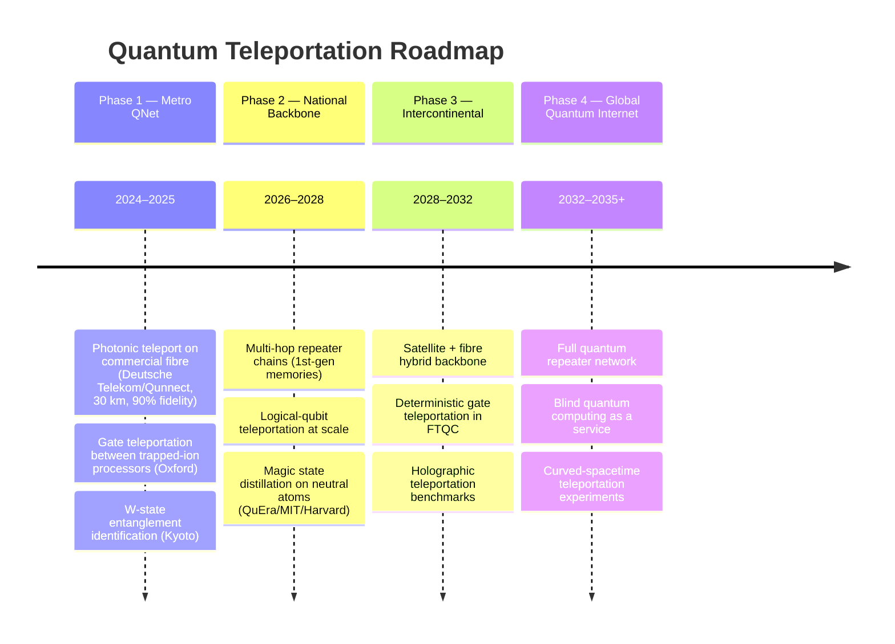
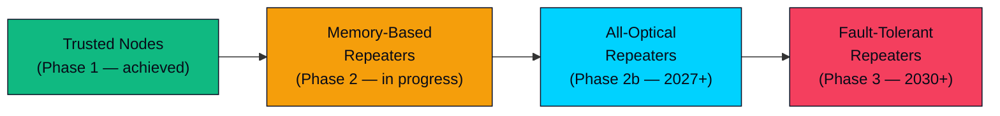
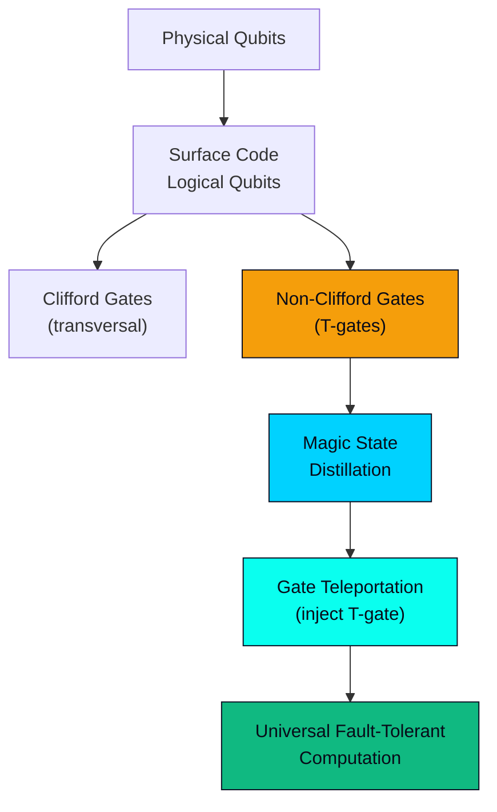
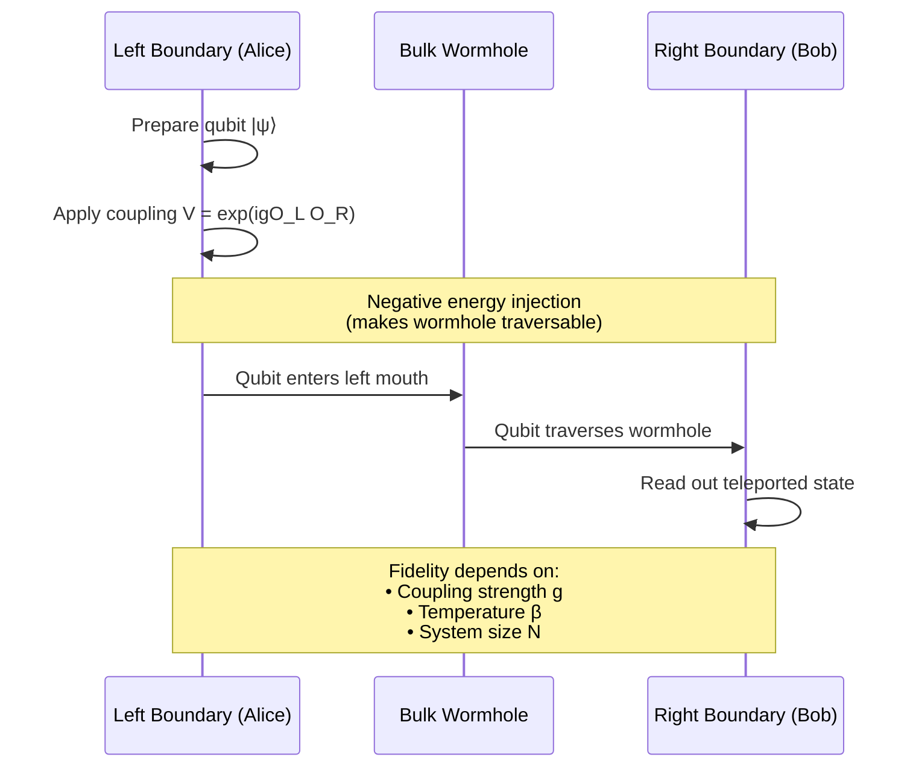

# Quantum Teleportation: Research Roadmap 2025–2035+

> **Status**: Living document — last updated March 2026  
> **Context**: Reference roadmap for the Wormhole Stability / Teleportation Noise research programme

---

## 1. Overview

Quantum teleportation — the transfer of quantum states via entanglement and classical communication — has evolved from a theoretical curiosity (Bennett et al., 1993) to a foundational primitive for quantum computing, quantum networks, and probes of quantum gravity. This roadmap synthesises the current state-of-the-art, near-to-far-term milestones, and open research frontiers as of early 2026.

---

## 2. Current State of the Art (2024–2026)

### 2.1 Photonic Teleportation on Real Infrastructure

| Milestone | Group / Year | Key Result |
|-----------|-------------|------------|
| Teleportation on commercial fibre | Deutsche Telekom + Qunnect, 2026 | 30 km, 90% avg fidelity, coexisting with classical traffic |
| Coexistence with existing internet | Northwestern (P. Kumar), 2024–25 | Quantum + classical on shared fibre — no dedicated dark-fibre needed |
| Identical photons from different quantum dots | Stuttgart, Nov 2025 | Enables scalable photonic entanglement sources |
| Deterministic multi-sideband teleportation | China, Dec 2025 | ~70% fidelity, surpassing no-cloning limit, multiple qumodes simultaneously |

### 2.2 Gate Teleportation for Fault-Tolerant Computing

| Milestone | Group / Year | Key Result |
|-----------|-------------|------------|
| Logical gate teleportation between processors | Oxford, Feb 2025 | Two trapped-ion processors connected via optical fibre; gates teleported to combine as single logical machine |
| Robust surface-code teleportation | 125-qubit superconducting processor, Feb 2026 | Topological rotated surface code, resilient to coherent errors |
| Magic teleportation via lattice surgery | Theoretical, Apr–May 2025 | Reduced operational complexity for non-Clifford gates |
| First practical magic state distillation | QuEra/MIT/Harvard, Jul 2025 | Neutral-atom processor; distilled imperfect magic states → high-fidelity |

### 2.3 Entanglement & W-States

| Milestone | Group / Year | Key Result |
|-----------|-------------|------------|
| W-state identification | Kyoto University, Sep 2025 | Multipartite entanglement class with enhanced robustness to particle loss |
| Multi-node teleportation (3 nodes) | QuTech Delft, 2022 (benchmark) | First quantum network with entanglement across non-adjacent nodes |

---

## 3. Near-Term Roadmap (2026–2028)

### 3.1 Quantum Repeaters: The Critical Bottleneck

**Key developments:**
- **Memory-based prototypes** demonstrated by groups in China, US, Europe (2026) — can store and forward quantum states
- **All-optical repeaters** with extended coherence quantum memories achieved (2025)
- **QTI (Italy)** secured €7M for repeater development (Dec 2025)
- **Room-temperature repeaters** remain theoretical — major open challenge

### 3.2 Quantum Network Phases (Wehner–Elkouss–Hanson Framework)

| Stage | Name | Status (2026) |
|-------|------|---------------|
| 1 | Trusted-node QKD | ✅ Operational (Beijing–Shanghai backbone) |
| 2 | Prepare-and-measure | ✅ Demonstrated |
| 3 | Entanglement distribution | 🔄 Metro-scale pilots (Singapore, Zurich, Ottawa) |
| 4 | **Quantum memory networks** | ← **Current frontier** |
| 5 | Fault-tolerant quantum networks | Theoretical designs |
| 6 | Full quantum internet | Vision (2035+) |

### 3.3 Near-Term Priorities

1. **Extend quantum memory coherence** to 100+ ms at telecom wavelengths
2. **Demonstrate 5+ node networks** with entanglement swapping
3. **Integrate QKD and teleportation** on commercial fibre infrastructure
4. **Standardise quantum network control architectures** (cf. arXiv white paper, Nov 2025)

---

## 4. Mid-Term Roadmap (2028–2032)

### 4.1 Fault-Tolerant Computing via Gate Teleportation

The primary near-term *application* of quantum teleportation is inside quantum computers:

**Industry roadmaps:**
- **IBM** → "Quantum Starling" (large-scale FTQC) by 2029; magic state injection with multiple modules by 2028
- **IBM** pivot to **qLDPC codes** → up to 90% overhead reduction vs conventional surface codes
- **Google Willow** → "below threshold" error correction demonstrated (exponentially reducing logical error rate)
- **Forrester (2026 report)**: FTQC progressing faster than expected; Q-day plausible by 2030

### 4.2 Satellite + Terrestrial Hybrid Networks

- **Canada QEYSSat** mission (2025–26): satellite-based QKD; QEYSSat 2.0 planned for long-range teleportation
- **China Micius** expansions: multi-node metropolitan additions to Beijing–Shanghai backbone (2025)
- **EU Quantum Communication Infrastructure (EuroQCI)**: connecting national networks

### 4.3 Noise & Fidelity Frontiers

| Research Direction | Latest Results |
|--------------------|---------------|
| Statistical framework for noisy teleportation | Jan 2026: Complete characterisation of fidelity distributions under decoherence; Bayesian adaptive protocols |
| Analog teleportation protocols | Can outperform digital protocols when channel doesn't reduce entanglement |
| Weak-measurement fidelity recovery | Probabilistic unit-fidelity even through noisy channels |
| Super-additive channel capacity | "Platypus channels" exhibit super-additivity when combined with erasure channels |
| Two-bit classical cost theorem | Jan 2026: Exactly 2 classical bits necessary and sufficient for perfect state transfer |

---

## 5. Long-Term Vision (2032–2035+)

### 5.1 Global Quantum Internet

- Teleportation as a network primitive (analogous to TCP/IP packet forwarding)
- **Blind quantum computing**: clients teleport encrypted qubits to server; server computes without seeing data
- **Distributed quantum computing**: modular processors linked by teleportation (the Oxford 2025 approach, scaled up)

### 5.2 Fundamental Physics Probes

This is the frontier most relevant to the Wormhole Stability programme:

- **Holographic teleportation benchmarks**: Establishing quantitative criteria to distinguish "wormhole-like" teleportation (holographic gravity dual) from trivial quantum channel correlations
- **Scaled SYK protocols**: Moving beyond N=7 (Google Sycamore 2022) to larger N, testing gravitational signatures
- **Curved-spacetime quantum information**: Teleportation fidelity as a probe of background geometry
- **Traversable wormhole channels**: Understanding when entanglement-assisted communication channels acquire a geometric (bulk) description

---

## 6. ER = EPR and Holographic Teleportation Protocols

### 6.1 The Conjecture

The ER = EPR conjecture (Maldacena & Susskind, 2013) proposes that every entangled pair (EPR) is connected by an Einstein–Rosen bridge (ER). This reframes:
- **Entanglement** → microscopic wormhole geometry
- **Teleportation** → signal traversing the wormhole (with negative energy injection)

### 6.2 The Jafferis–Gao–Wall Protocol (2017+)

### 6.3 SYK Model as the Testbed

The Sachdev–Ye–Kitaev model (N Majorana fermions with random q-body interactions) is the primary theoretical laboratory:

| Result | Year | Significance |
|--------|------|-------------|
| Wormhole-Inspired Teleportation Protocol (WITP) | 2024–25 | SYK chaos → consistently higher teleportation fidelity vs non-chaotic models |
| Two-qubit Bell-state teleportation via SYK | 2025 | Notable fidelity boost over single-qubit; β-regime dependent |
| Phase transitions in 4-coupled SYK | Nov 2025 | First-order transitions at T=0 ↔ exchange of traversable wormhole configurations |
| Real-time wormhole formation | 2025 | Simulating cooling of coupled SYK → ground state = wormhole |
| Two-local SYK modifications + quantum chaos | 2026 | Exploring how locality structure affects scrambling and teleportation |
| Caltech/Google experimental ER=EPR evidence | 2025 | Qubit teleportation showing "tangible observational evidence" of ER=EPR on Sycamore |

### 6.4 Open Questions

1. **Distinguish gravity from noise**: Can we design teleportation witnesses that certify a holographic (gravitational) mechanism vs a purely information-theoretic one?
2. **Scaling N**: The Google Sycamore experiment used N=7 Majoranas (heavily compressed). What is the minimum N for unambiguous gravitational signatures?
3. **Noise budget**: How much decoherence can a holographic teleportation protocol tolerate before the geometric (bulk) interpretation breaks down? ← *Directly addressed by the teleportation_noise manuscript*
4. **Beyond SYK**: Are there physically realisable Hamiltonians (e.g., cold atoms, trapped ions) that exhibit the same teleportation–traversability connection?
5. **Multi-boundary wormholes**: Extending ER=EPR to multipartite entanglement (W-states, GHZ) and multi-mouth wormhole geometries

---

## 7. Key Papers & References (2025–2026)

### Quantum Teleportation — Experimental

| Paper / Result | Source | Date |
|----------------|--------|------|
| Quantum teleportation on 30 km commercial fibre | Deutsche Telekom + Qunnect | 2026 |
| Logical gate teleportation between trapped-ion processors | Oxford, *Nature* | Feb 2025 |
| Identical photons from different quantum dots | Stuttgart, *Nat. Commun.* | Nov 2025 |
| W-state entanglement identification | Kyoto, *Science Daily* | Sep 2025 |
| Data teleportation between quantum processors | Oxford | Feb 2025 |
| Deterministic multi-sideband qumode teleportation | China, *SciTechDaily* | Dec 2025 |
| Robust surface-code teleportation (125-qubit) | Superconducting processor | Feb 2026 |

### Fault-Tolerant Computing & Gate Teleportation

| Paper / Result | Source | Date |
|----------------|--------|------|
| First practical magic state distillation | QuEra/MIT/Harvard, neutral atoms | Jul 2025 |
| Magic teleportation via lattice surgery | Theoretical (Bletchley) | Apr–May 2025 |
| Fault-tolerant surface-code patch connections under noise | arXiv | Mar 2025 |
| Optimised 15-to-1 magic state preparation | arXiv | Mar 2026 |
| Erasure-qubit magic state injection | Theoretical | May 2025 |

### Quantum Networks & Repeaters

| Paper / Result | Source | Date |
|----------------|--------|------|
| All-optical repeaters with extended coherence | Multiple groups | 2025 |
| Quantum repeater generations overview | IEEE Commun. Mag. | Jan 2025 |
| QTI €7M repeater development project | CNR-INO / Univ. Florence | Dec 2025 |
| Quantum coexistence on shared fibre | Northwestern (P. Kumar) | 2024–25 |
| Computer science challenges for quantum internet | arXiv white paper | Nov 2025 |

### Noise, Fidelity & Channel Theory

| Paper / Result | Source | Date |
|----------------|--------|------|
| Statistical framework for noisy teleportation fidelity | ResearchGate | Jan 2026 |
| Analog teleportation outperforming digital protocols | arXiv | 2025 |
| Super-additive quantum channel capacity (platypus channels) | arXiv | May 2025 |
| Weak-measurement fidelity recovery | ResearchGate | 2025 |

### ER = EPR & Holographic Teleportation

| Paper / Result | Source | Date |
|----------------|--------|------|
| Experimental ER=EPR evidence (Caltech/Google Sycamore) | SpaceFed | 2025 |
| SYK two-qubit wormhole teleportation protocol | arXiv | 2025 |
| Phase transitions in 4-coupled SYK models | ResearchGate | Nov 2025 |
| Real-time wormhole formation simulation | ResearchGate | 2025 |
| Two-local SYK modifications and quantum chaos | arXiv | 2026 |
| Traversable wormholes as entanglement-assisted channels | World Scientific | 2024–25 |

---

## 8. Implications for the Wormhole Stability Programme

The noise characterisation work in `teleportation_noise_v5.0.tex` is positioned at the intersection of two critical roadmap threads:

1. **Practical**: Teleportation fidelity bounds under realistic noise models directly inform quantum repeater and gate teleportation engineering
2. **Fundamental**: The noise budget for ER=EPR protocols determines whether near-term experiments can distinguish gravitational correlations from decoherence artefacts

### Recommended Next Steps

- [ ] Benchmark teleportation noise model against Jan 2026 statistical framework (Bayesian adaptive protocols)
- [ ] Compare CFD wormhole stability thresholds with SYK teleportation fidelity phase transitions (Nov 2025)
- [ ] Evaluate analog vs digital teleportation protocols in the holographic setting
- [ ] Investigate W-state connections to multi-mouth wormhole geometries
- [ ] Identify experimental proposals distinguishing holographic teleportation from trivial quantum channels

---

*This roadmap is a living document. Update as new results appear.*
